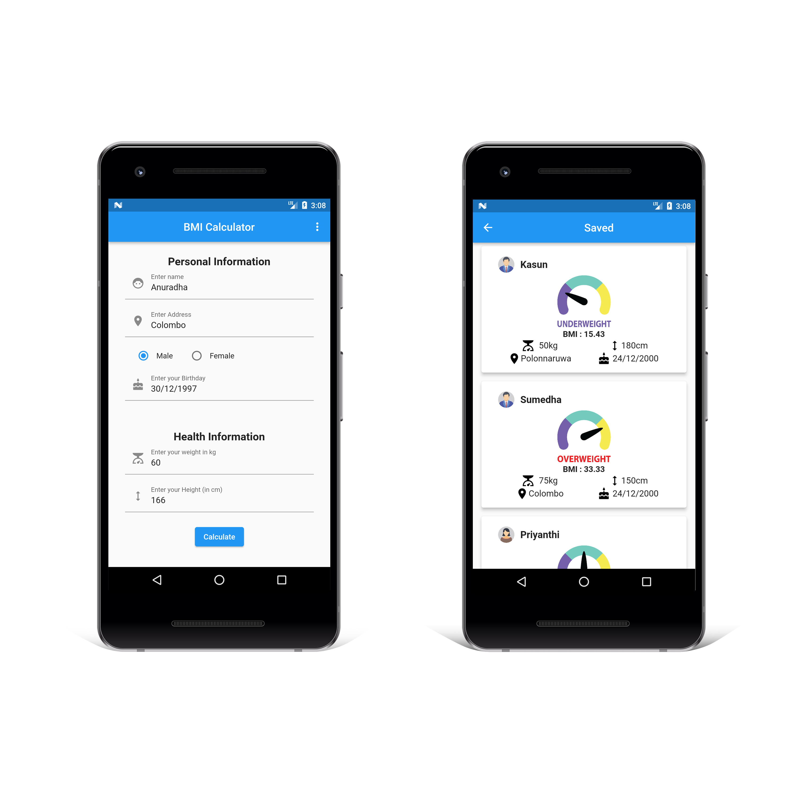

# BMI Calculator App

Welcome to the BMI Calculator App, a simple yet powerful tool for tracking and managing Body Mass Index (BMI). This app, developed using **Flutter** and **Firebase** technologies, allows users to effortlessly calculate and monitor BMI values.

## Features

-   **User Authentication**: Securely create accounts and log in to personalize your BMI tracking experience.
-   **Input Personal Details**: Easily input height and weight for accurate BMI calculations.
-   **Instant BMI Calculation**: Click the calculate button to instantly view your Body Mass Index.
-   **Save BMI Information**: Optionally save BMI data for future reference.
-   **View and Track Data**: Access and track BMI information for individuals at any time.

## License 
This project distributed under the GPL V2 license. When you make changes the source code, you must give the permission for owner and give the credits to the authorized owner.

