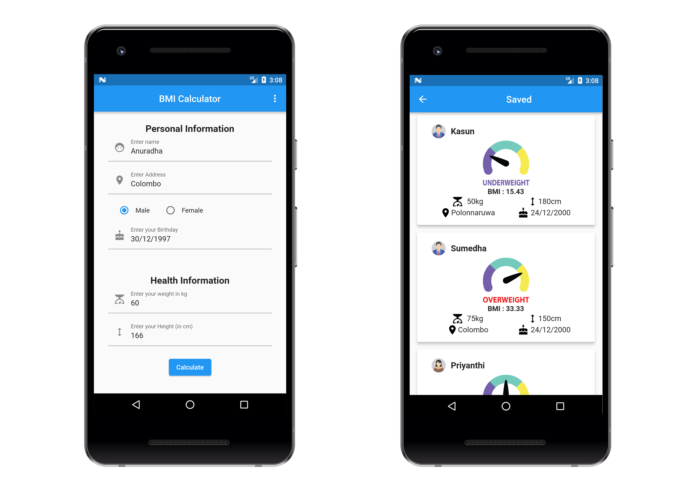

# BMI Calculator App

Welcome to the BMI Calculator App, a simple yet powerful tool for tracking and managing Body Mass Index (BMI). This app, developed using **Flutter** and **Firebase** technologies, allows users to effortlessly calculate and monitor BMI values.

## Features

-   **User Authentication**: Securely create accounts and log in to personalize your BMI tracking experience.
-   **Input Personal Details**: Easily input height and weight for accurate BMI calculations.
-   **Instant BMI Calculation**: Click the calculate button to instantly view your Body Mass Index.
-   **Save BMI Information**: Optionally save BMI data for future reference.
-   **View and Track Data**: Access and track BMI information for individuals at any time.

## License 
This software is distributed under the terms of the GNU General Public License version 2 (GPLv2). Users are granted the freedom to modify the source code, subject to compliance with GPLv2 stipulations. These requirements encompass the sharing of any distributed modifications' source code under the GPLv2, the preservation of original copyright notices, the proper crediting of authors, and the refraining from imposing additional restrictions on the software.

